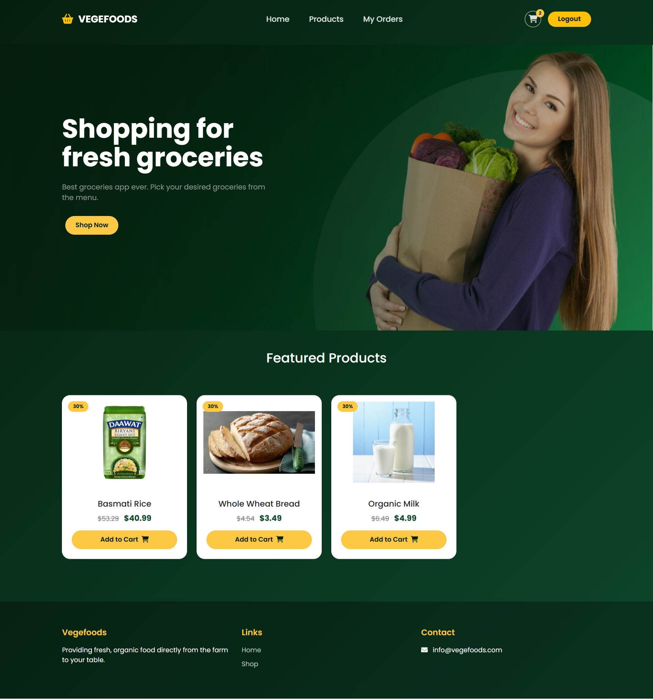
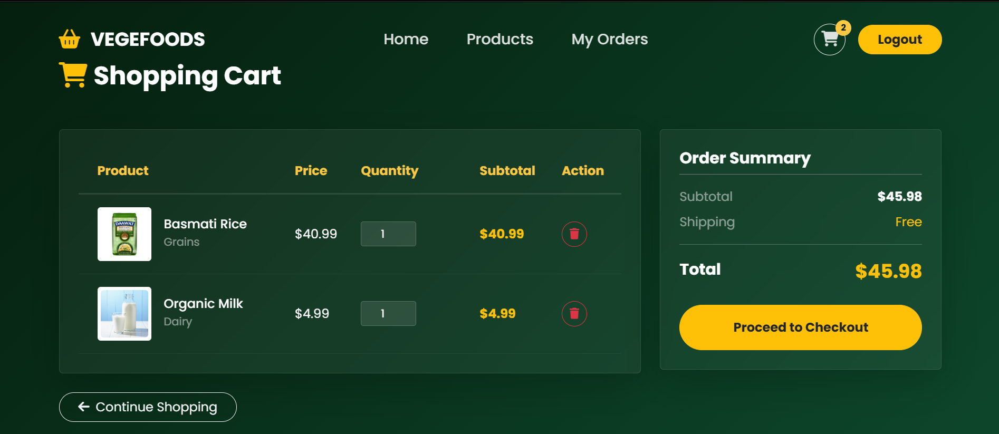
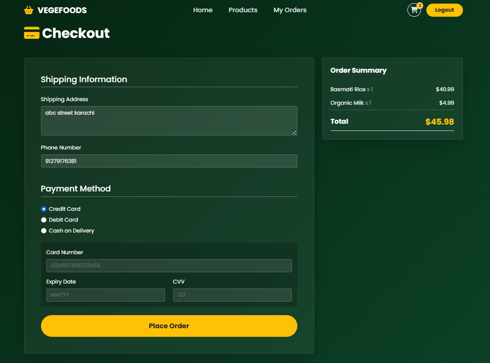
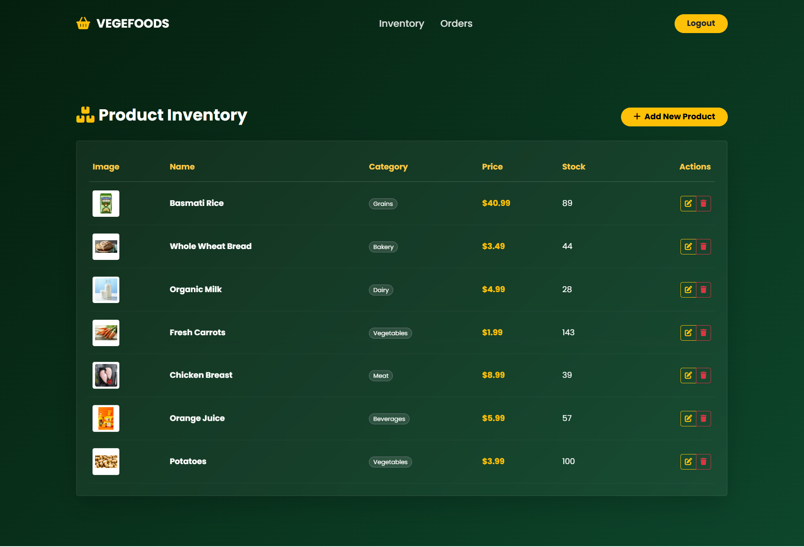
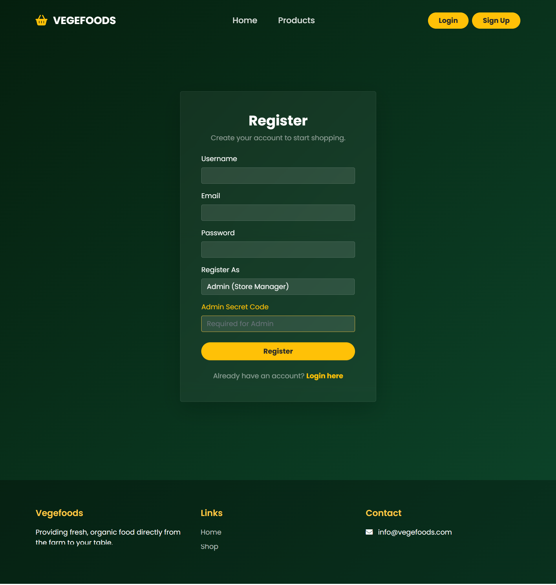
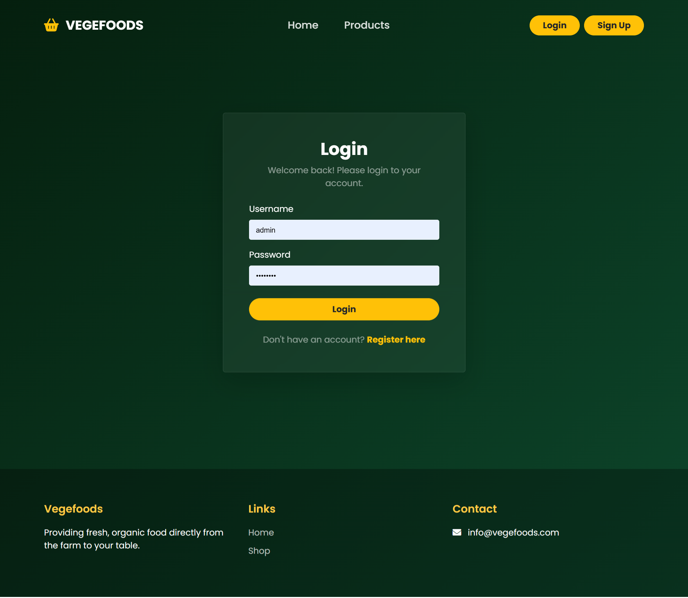

🛒 Grocery Store Management System

A full-stack e-commerce web application built with Flask (Python). This system features role-based authentication (Admin vs. Customer), inventory management, a shopping cart, and order tracking.

🚀 Features

👤 Customer Features
* User Authentication: Secure Login and Registration.
* Browse Products: View products by category with images and stock status.
* Shopping Cart: Add items, update quantities, and remove items.
* Checkout System: Place orders with delivery details.
* Order History: Track order status (Processing, Shipped, Delivered) and view past purchases.

🛡️ Admin Features
* Inventory Management: Add, edit, and update product details (Price, Stock, Images).
* Order Management: View all customer orders and update their shipping status.
* Dashboard: Quick overview of store inventory.

🛠️ Tech Stack
* Backend: Python, Flask, Flask-SQLAlchemy, Flask-Login
* Frontend: HTML5, Jinja2 Templating, Bootstrap 5
* Database: SQLite (SQLAlchemy ORM)

📦 Installation & Setup

1. Clone the repository
    ```bash
    git clone [https://github.com/Kamey12/grocery-system.git](https://github.com/Kamey12/grocery-system.git)
    cd grocery_system
    ```

2. Create and activate a virtual environment
    ```bash
    Windows
    python -m venv venv
    venv\Scripts\activate

    Mac/Linux
    python3 -m venv venv
    source venv/bin/activate
    ```

3. Install dependencies
    ```bash
    pip install -r requirements.txt
    ```

4. Run the application
    This command will initialize the database and create the default admin user automatically.
    ```bash
    python run.py
    ```

5. Access the App
    Open your browser and go to: `http://127.0.0.1:5000`

🔑 Default Credentials

The system automatically creates an Admin account on the first run:

* Username: `admin`
* Password: `admin123`

## 📂 Project Structure

```text
GROCERY SYSTEM/
├── screenshots/             # Images for README
├── run.py                   # Application Entry point
├── requirements.txt         # Dependencies
└── grocery_system/
    ├── __init__.py          # App factory
    ├── models.py            # Database models
    ├── routes/              # Modular routes (auth, main, store, admin)
    ├── static/              # CSS, Images, JS
    └── templates/           # HTML files
```
## 📸 Project Screenshots

| **Dashboard** | **Product Page** |
|:---:|:---:|
|  |  |
| *Modern landing page with floating cards* | *Product page to browse* |

| **Shopping Cart** | **Secure Checkout** |
|:---:|:---:|
|  |  |
| *Interactive cart with quantity controls* | *Checkout with payment validation* |

| **Admin Inventory** | **Order Status Update** |
|:---:|:---:|
|  |  |
| *Admin Access page to Add,Update,Delete Inventory* | *Validate & Update the status of Order* |

| **SignUp** | **LogIn** |
|:---:|:---:|
|  |  |
| *Signup Page* | *Login Page* |

---
